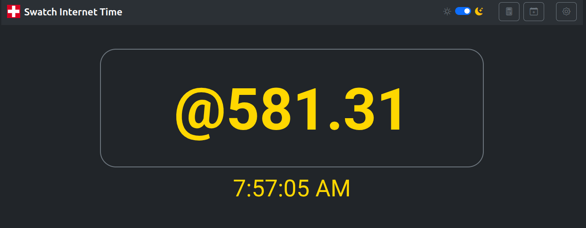

# Swatch Internet Time

version 0.2.0-beta

A modern Preact application for displaying and managing Swatch Internet Time (.beats), featuring reminder integration, time conversion, and customizable settings.



## About Swatch Internet Time

Swatch Internet Time is a decimal time concept introduced by the Swatch corporation in 1998. It divides the day into 1,000 "beats" instead of hours, minutes, and seconds. Each beat is equivalent to 1 minute and 26.4 seconds. The day starts at midnight BMT (Biel Mean Time, UTC+1).

**Learn more:**

- https://www.swatch.com/en-us/internet-time.html

- https://en.wikipedia.org/wiki/Swatch_Internet_Time


## App Features

### Core Display
- **Real-time Swatch Internet Time Clock**: Displays current time in .beats format (@000.00 - @999.99)
- **Includes centibeats**: Displays .beat time with 2 decimal places of accuracy
- **Updates every second** for accurate timekeeping
- **Customizable display** with multiple font options and sizes
- **Light/Dark Theme**: Toggle between light and dark themes

### Settings Panel
Access via the gear icon to customize your experience:
- **Font Color**: Choose any color for the time display
- **Font Size**: Adjust from 20px to 200px with a slider
- **Font Family**: Select from 4 Google Fonts:
  - Roboto
  - Open Sans
  - Lato
  - Montserrat
- **Show Local Time**: Toggle to display local time below Swatch time
- **12/24-Hour Format**: Switch between 12-hour (AM/PM) and 24-hour format for local time


### Reminders
Create and manage simple reminders using Swatch Internet Time:
- **Reminder Creation Form**:
  - Title and Description
  - Start Date & Time (or enter Swatch beats)
  - Reminders are single occurrences (no repeat options)
  - Swatch beats accepted in formats like `@123`, `123.45`

### Reminder System
Bell icon feature for event notifications:
- **Visual indicator**: Bell icon highlights when reminders are active
- **Modal notifications**: Displays event details when reminder time arrives
- **Dual actions**:
  - **OK**: Acknowledges reminder but keeps bell icon active
  - **Dismiss**: Removes reminder and clears bell notification
- **Reopen reminders**: Click bell icon to view active reminders again
- **Persistent until dismissed**: Bell remains highlighted until dismissed

### Time Calculator
Convert between Swatch and Local time:
- **Calculator icon** opens conversion tool
- **Bidirectional conversion**: 
  - Enter Swatch beats → Get local time (HH:MM:SS)
  - Enter local time → Get Swatch beats
- **Real-time updates**: Changes in one field automatically update the other
- **24-hour format** for local time input/output

## Installation

### Prerequisites
- Node.js 20.x or later
- npm 10.x or later

### Setup
```bash
# Clone the repository
git clone https://github.com/kendawson-online/swatch-preact.git
cd swatch-preact

# Install dependencies
npm install
```

## Usage

### Development Server
Start the development server with hot module replacement:
```bash
npm run dev
```
The app will be available at `http://localhost:5173/`

### Production Build
Build the app for production:
```bash
npm run build
```
The optimized build will be in the `dist/` directory.

### Preview Production Build
Preview the production build locally:
```bash
npm run preview
```

## Testing

Currently, the project uses Vite's built-in build validation. To test:
```bash
# Build the project (validates all imports and exports)
npm run build

# Run the development server and manually test features
npm run dev
```

## Technology Stack

- **Preact 10.27.2**: Fast 3kB alternative to React with the same modern API
- **Vite 7.2.2**: Next-generation frontend tooling for fast development
- **Bootstrap 5.3.8**: Latest Bootstrap for responsive UI and modals
- **Bootstrap Icons**: Icon library for UI elements
- **Google Fonts**: Roboto, Open Sans, Lato, and Montserrat

## Architecture

```
src/
├── components/
│   ├── SwatchClock.jsx       # Main time display component
│   ├── SettingsModal.jsx     # Settings configuration modal
│   ├── ReminderModal.jsx     # Reminder creation modal
│   ├── ReminderBell.jsx      # Notification system
│   └── TimeCalculator.jsx    # Time conversion tool
├── utils/
│   └── swatchTime.js         # Swatch time calculation utilities
├── app.jsx                   # Main application component
└── main.jsx                  # Application entry point
```

## Browser Support

- Modern browsers with ES6+ support
- Chrome, Firefox, Safari, Edge (latest versions)

## Contributing

Contributions are welcome! Please feel free to submit a Pull Request.

## License

Released under the MIT [LICENSE].