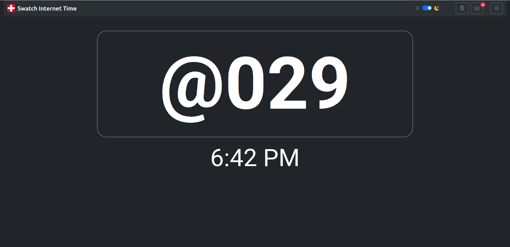

# Swatch Internet Time

version 0.2.0-beta

A modern Preact application for displaying and managing Swatch Internet Time (.beats), featuring reminder integration, time conversion, and customizable settings.



## About Swatch Internet Time

Swatch Internet Time is a decimal time concept introduced by the Swatch corporation in 1998. It divides the day into 1,000 "beats" instead of hours, minutes, and seconds. Each beat is equivalent to 1 minute and 26.4 seconds. The day starts at midnight BMT (Biel Mean Time, UTC+1).

**Learn more:**

- https://www.swatch.com/en-us/internet-time.html

- https://en.wikipedia.org/wiki/Swatch_Internet_Time


## App Features

### Core Display
- **Real-time Swatch Internet Time Clock**: Displays current time in .beats format (@000.00 - @999.99)
- **Includes centibeats**: Displays .beat time with 2 decimal places of accuracy
- **Updates every second** for accurate timekeeping
- **Customizable display** with multiple font options and sizes
- **Light/Dark Theme**: Toggle between light and dark themes

### Settings Panel
Access via the gear icon to customize your experience:
- **Font Color**: Choose any color for the time display
- **Font Size**: Adjust from 20px to 200px with a slider
- **Font Family**: Select from 4 Google Fonts:
  - Roboto
  - Open Sans
  - Lato
  - Montserrat
- **Show Local Time**: Toggle to display local time below Swatch time
- **12/24-Hour Format**: Switch between 12-hour (AM/PM) and 24-hour format for local time


### Reminders
Create and manage simple reminders using Swatch Internet Time:
- **Reminder Creation Form**:
  - Title and Description
  - Start Date & Time (or enter Swatch beats)
  - Reminders are single occurrences (no repeat options)
  - Swatch beats accepted in formats like `@123`, `123.45`

### Reminder System
Bell icon feature for event notifications:
- **Visual indicator**: Bell icon highlights when reminders are active
- **Modal notifications**: Displays event details when reminder time arrives
- **Dual actions**:
  - **OK**: Acknowledges reminder but keeps bell icon active
  - **Dismiss**: Removes reminder and clears bell notification
- **Reopen reminders**: Click bell icon to view active reminders again
- **Persistent until dismissed**: Bell remains highlighted until dismissed

### Time Calculator
Convert between Swatch and Local time:
- **Calculator icon** opens conversion tool
- **Bidirectional conversion**: 
  - Enter Swatch beats → Get local time (HH:MM:SS)
  - Enter local time → Get Swatch beats
- **Real-time updates**: Changes in one field automatically update the other
- **24-hour format** for local time input/output

## Technology Stack

- **Preact 10.27.2**: Fast 3kB alternative to React with the same modern API
- **Vite 7.2.2**: Next-generation frontend tooling for fast development
- **Bootstrap 5.3.8**: Latest Bootstrap for responsive UI and modals
- **Bootstrap Icons**: Icon library for UI elements
- **Google Fonts**:  stored in a JSON file at: public/google-fonts.json

## Architecture

```
swatch-preact/
├── index.html
├── package.json
├── package-lock.json
├── public
│   ├── google-fonts.json
│   ├── manifest.json
│   ├── screenshot.png
│   ├── swiss-flag.svg
│   └── sw.js
├── README.md
├── src
│   ├── app.jsx
│   ├── components
│   │   ├── ColorPicker.jsx
│   │   ├── FontPreview.jsx
│   │   ├── Footer.jsx
│   │   ├── Navbar.jsx
│   │   ├── ReminderBell.jsx
│   │   ├── ReminderForm.jsx
│   │   ├── RemindersList.jsx
│   │   ├── SettingsModal.jsx
│   │   ├── SwatchClock.jsx
│   │   └── TimeCalculator.jsx
│   ├── hooks
│   │   └── useBootstrapModal.js
│   ├── main.jsx
│   ├── signals
│   │   └── store.js
│   ├── styles.css
│   └── utils
│       ├── fonts.js
│       ├── notifications.js
│       ├── reminderTime.js
│       ├── storage.js
│       └── swatchTime.js
└── vite.config.js

7 directories, 30 files
```

## Important: Rounding and display

When rendering centibeats (two decimal places) the app and any related code should avoid temporarily displaying `1000.00` due to rounding. The correct approach is to round the raw beats to two decimals, then wrap any value >= 1000 back into the 0..999.99 range before formatting for display. Example:

```js
const rawBeats = bielSeconds / 86.4;
let rounded = Math.round(rawBeats * 100) / 100;
if (rounded >= 1000) rounded = rounded - 1000;
const display = rounded.toFixed(2);
```

This preserves conventional rounding while guaranteeing the UI never shows `1000.00` briefly.

## Browser Support

- Modern browsers with ES6+ support
- Chrome, Firefox, Safari, Edge (latest versions)

## License

[MIT License](LICENSE)

## Contact

Contact: admin@swatchtime.online


## Disclaimer:

This site is an independent revival of Swatch Internet Time and is not affiliated with Swatch Group. You can visit the official Swatch web site here: <a href="https://www.swatch.com/en-us/" target="_blank" rel="noopener noreferrer">https://www.swatch.com/</a>